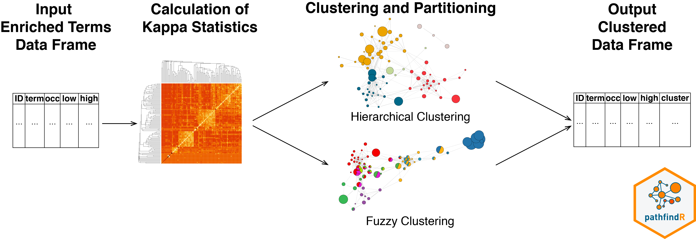

```{r setup, include = FALSE}
knitr::opts_chunk$set(collapse = TRUE,
                      comment = "#>",
                      eval = FALSE,
                      fig.width = 7, fig.height = 7, fig.align = "center")
suppressPackageStartupMessages(library(pathfindR))
```

`pathfindR` is a tool for enrichment analysis via active subnetworks. The package also offers functionalities to cluster the enriched terms and identify representative terms in each cluster, to score the enriched terms per sample and to visualize analysis results.
    
The functionalities of pathfindR is described in detail in _Ulgen E, Ozisik O, Sezerman OU. 2019. pathfindR: An R Package for Comprehensive Identification of Enriched Pathways in Omics Data Through Active Subnetworks. Front. Genet. [https://doi.org/10.3389/fgene.2019.00858](https://doi.org/10.3389/fgene.2019.00858)_

# Overview

The observation that motivated us to develop `pathfindR` was that direct enrichment analysis of differential RNA/protein expression or DNA methylation results may not provide the researcher with the full picture. That is to say: enrichment analysis of only a list of significant genes alone may not be informative enough to explain the underlying disease mechanisms. Therefore, we considered leveraging interaction information from a protein-protein interaction network (PIN) to identify distinct active subnetworks and then perform enrichment analyses on these subnetworks.

> An active subnetwork can be defined as a group of interconnected genes in a PIN that predominantly consists of significantly altered genes. In other words, active subnetworks define distinct disease-associated sets of interacting genes, whether discovered through the original analysis or discovered because of being in interaction with a significant gene.

The active-subnetwork-oriented enrichment analysis approach of pathfindR can be summarized as follows: Mapping the input genes with the associated p values onto the PIN (after processing the input), active subnetwork search is performed. The resulting active subnetworks are then filtered based on their scores and the number of significant genes they contain. This filtered list of active subnetworks are then used for enrichment analyses, i.e. using the genes in each of the active subnetworks, the significantly enriched terms (pathways/gene sets) are identified. Enriched terms with adjusted p values larger than the given threshold are discarded and the lowest adjusted p value (over all active subnetworks) for each term is kept. This process of `active subnetwork search + enrichment analyses` is repeated for a selected number of iterations, performed in parallel. Over all iterations, the lowest and the highest adjusted-p values, as well as number of occurrences over all iterations are reported for each significantly enriched term in the resulting data frame. An HTML report containing the results is also provided containing links to the visualizations of the enriched terms. This active-subnetwork-oriented enrichment approach is demonstrated in the section [Active-subnetwork-oriented Enrichment Analysis] of this vignette.

The enrichment analysis usually yields a great number of enriched terms whose biological functions are related. Therefore, we implemented two clustering approaches using a pairwise distance matrix based on the kappa statistics between the enriched terms (as proposed by Huang et al. [^1]). Based on this distance metric, the user can perform either hierarchical (default) or fuzzy clustering of the enriched terms. Details of clustering and partitioning of enriched terms are presented in the [Clustering Enriched Terms] section of this vignette.

Other functionalities of pathfindR including:

- agglomerated score calculation per each term (to investigate how a gene set is altered in a given sample)
- visualization of terms and term-related genes as a graph (to determine the degree of overlap between the enriched terms by identifying shared and/or distinct significant genes) and
- pathfindR analysis with custom gene sets are also briefly described.

# Active-subnetwork-oriented Enrichment Analysis


For convenience, we provide  the wrapper function `run_pathfindR()` to be used for the active-subnetwork-oriented enrichment analysis. The input for this function must be a data frame consisting of the columns containing: `Gene Symbols`, `Change Values` (optional) and `p values`. The example data frame used in this vignette (`input_df`) is the dataset containing the differentially-expressed genes for the GEO dataset GSE15573 comparing 18 rheumatoid arthritis (RA) patients versus 15 healthy subjects.

The first 6 rows of the example input data frame are displayed below:

```{r load_pkg, eval=TRUE}
library(pathfindR)
knitr::kable(head(RA_input))
```

> For a detailed step-by-step explanation and an unwrapped demonstration of the active-subnetwork-oriented enrichment analysis, see the vignette [Step-by-Step Execution of the pathfindR Enrichment Workflow](manual_execution.html)

Executing the workflow is straightforward (but does typically take several minutes):

```{r run_pathfindR}
output_df <- run_pathfindR(input_df)
```

## Useful arguments

This subsection demonstrates some (selected) useful arguments of `run_pathfindR()`. For a full list of arguments, see `?run_pathfindR` or visit [our GitHub wiki](https://github.com/egeulgen/pathfindR/wiki).

### Filtering Input Genes

By default, `run_pathfindR()` uses the input genes with p-values < 0.05. To change this threshold, use `p_val_threshold`:

```{r change_input_thr}
output_df <- run_pathfindR(input_df, p_val_threshold = 0.01)
```

### Output Directory
By default, `run_pathfindR()` creates a directory named `"pathfindR_Results"` under the current working directory for writing the output files. To change the output directory, use `output_dir`:

```{r change_out_dir}
output_df <- run_pathfindR(input_df, output_dir = "this_is_my_output_directory")
```

This creates `"this_is_my_output_directory"` under the current working directory.

In essence, this argument is treated as a path so it can be used to create the output directory anywhere. For example, to create the directory `"my_dir"` under `"~/Desktop"` and run the analysis there, you may run:

```{r change_out_dir2}
output_df <- run_pathfindR(input_df, output_dir = "~/Desktop/my_dir")
```

> Note: If the output directory (e.g. `"my_dir"`) already exists, `run_pathfindR()` creates and works under `"my_dir(1)"`. If that exists also exists, it creates `"my_dir(2)"` and so on. This was intentionally implemented so that any previous pathfindR results are not overwritten.

### Gene Sets for Enrichment

The active-subnetwork-oriented enrichment analyses can be performed on any gene sets (biological pathways, gene ontology terms, transcription factor target genes, miRNA target genes etc.). The available gene sets in pathfindR are "KEGG", "Reactome", "BioCarta", "GO-All", "GO-BP", "GO-CC" and "GO-MF" (all for Homo sapiens). For changing the default gene sets for enrichment analysis (hsa KEGG pathways), use the argument `gene_sets`

```{r change_gset1}
output_df <- run_pathfindR(input_df, gene_sets = "GO-MF")
```

By default, `run_pathfindR()` filters the gene sets by including only the terms containing at least 10 and at most 300 genes. To change the default behavior, you may change `min_gset_size` and `max_gset_size`:

```{r change_gset2}
## Including more terms for enrichment analysis
output_df <- run_pathfindR(input_df, 
                           gene_sets = "GO-MF",
                           min_gset_size = 5,
                           max_gset_size = 500)
```

> Note that increasing the number of terms for enrichment analysis may result in significantly longer run time.

If the user prefers to use another gene set source, the `gene_sets` argument should be set to `"Custom"` and the custom gene sets (list) and the custom gene set descriptions (named vector) should be supplied via the arguments `custom_genes` and `custom_descriptions`, respectively. See `?fetch_gene_set` for more details and [Analysis with Custom Gene Sets] for a simple demonstration.

### Filtering Enriched Terms by Adjusted-p Values

By default, `run_pathfindR()` adjusts the enrichment p values via the "bonferroni" method and filters the enriched terms by adjusted-p value < 0.05. To change this adjustment method and the threshold, set `adj_method` and `enrichment_threshold`, respectively:

```{r change_enr_threshold}
output_df <- run_pathfindR(input_df, 
                           adj_method = "fdr",
                           enrichment_threshold = 0.01)
```

### Protein-protein Interaction Network

For the active subnetwork search process, a protein-protein interaction network (PIN) is used. `run_pathfindR()` maps the input genes onto this PIN and identifies active subnetworks which are then be used for enrichment analyses. To change the default PIN ("Biogrid"), use the `pin_name_path` argument:

```{r change_PIN1}
output_df <- run_pathfindR(input_df, pin_name_path = "IntAct")
```

The `pin_name_path` argument can be one of "Biogrid", "STRING", "GeneMania", "IntAct", "KEGG", "mmu_STRING" or it can be the path to a custom PIN file provided by the user.

```{r change_PIN2}
# to use an external PIN of your choice
output_df <- run_pathfindR(input_df, pin_name_path = "/path/to/myPIN.sif")
```

> NOTE: the PIN is also used for generating the background genes (in this case, all unique genes in the PIN) during hypergeometric-distribution-based tests in enrichment analyses. Therefore, a large PIN will generally result in better results.

### Active Subnetwork Search Method

Currently, there are three algorithms implemented in pathfindR for active subnetwork search: Greedy Algorithm (default, based on Ideker et al. [^2]), Simulated Annealing Algorithm (based on Ideker et al. [^2]) and Genetic Algorithm (based on Ozisik et al. [^3]). For a detailed discussion on which algorithm to use see [this wiki entry](https://github.com/egeulgen/pathfindR/wiki/Active-subnetwork-oriented-Enrichment-Documentation#selecting-the-active-subnetwork-search-algorithm)

```{r change_method}
# for simulated annealing:
output_df <- run_pathfindR(input_df, search_method = "SA")
# for genetic algorithm:
output_df <- run_pathfindR(input_df, search_method = "GA")
```

### Other Arguments 

Because the active subnetwork search algorithms are stochastic, `run_pathfindR()` iterates the active subnetwork identification and enrichment steps multiple times (by default 10 times). To change this number, set `iterations`:

```{r change_n_iters}
output_df <- run_pathfindR(input_df, iterations = 25) 
```

`run_pathfindR()` uses a parallel loop (using the package `foreach`) for performing these iterations in parallel. By default, the number of processes to be used is determined automatically. To override, change `n_processes`:

``` {r change_n_proc}
# n_processes defaults to (number of detected cores - 1)
output_df <- run_pathfindR(input_df, n_processes = 2)
```

## Output

### Enriched Terms Data Frame
`run_pathfindR()` returns a data frame of enriched terms. Columns are:

- ID: ID of the enriched term
- Term_Description: Description of the enriched term
- Fold_Enrichment: Fold enrichment value for the enriched term (Calculated using ONLY the input genes)
- occurrence: The number of iterations that the given term was found to enriched over all iterations
- lowest_p: the lowest adjusted-p value of the given term over all iterations
- highest_p: the highest adjusted-p value of the given term over all iterations
- non_Signif_Snw_Genes (OPTIONAL): the non-significant active subnetwork genes, comma-separated (controlled by `list_active_snw_genes`, default is `FALSE`)
- Up_regulated: the up-regulated genes (as determined by `change value` > 0, if the `change column` was provided) in the input involved in the given term's gene set, comma-separated. If change column was not provided, all affected input genes are listed here.
- Down_regulated: the down-regulated genes (as determined by `change value` < 0, if the `change column` was provided) in the input involved in the given term's gene set, comma-separated

The first 2 rows of the output data frame of the example analysis on the rheumatoid arthritis gene-level differential expression input data (`RA_input`) is shown below:

```{r example_out, eval=TRUE}
knitr::kable(head(RA_output, 2))
```

By default, `run_pathfindR()` also produces a graphical summary of enrichment results for top 10 enriched terms, which can also be later produced by `enrichment_chart()`:

```{r encrichment_plot, eval=TRUE, echo=FALSE}
enrichment_chart(RA_output)
```

You may also disable plotting this chart by setting `plot_enrichment_chart=FALSE` and later produce this plot via the function `enrichment_chart()`:

```{r encrichment_plot_shown, eval=FALSE}
# change number of top terms plotted (default = 10)
enrichment_chart(result_df = RA_output, 
                 top_terms = 15)
```

### HTML Report

The function also creates an HTML report `results.html` that is saved in the output directory. This report contains links to two other HTML files:

**1. `enriched_terms.html`**

This document contains the table of the active subnetwork-oriented enrichment results (same as the returned data frame). By default, each enriched term description is linked to the visualization of the term, with the gene nodes colored according to their change values. If you choose not to create the visualization files, set `visualize_enriched_terms = FALSE`.

**2. `conversion_table.html`**

This document contains the table of converted gene symbols. Columns are:

- Old Symbol: the original gene symbol
- Converted Symbol: the alias symbol that was found in the PIN
- Change: the provided change value
- p-value: the provided adjusted p value

> During input processing, gene symbols that are not in the PIN are identified and excluded. For human genes, if aliases of these missing gene symbols are found in the PIN, these symbols are converted to the corresponding aliases (controlled by the argument `convert2alias`). This step is performed to best map the input data onto the PIN.

The document contains a second table of genes for which **no interactions** were identified after checking for alias symbols (so these could not be used during the analysis).


# Clustering Enriched Terms



The wrapper function `cluster_enriched_terms()` can be used to perform clustering of enriched terms and partitioning the terms into biologically-relevant groups. Clustering can be performed either via `hierarchical` or `fuzzy` method using the pairwise kappa statistics (a chance-corrected measure of co-occurrence between two sets of categorized data) matrix between all enriched terms.

## Hierarchical Clustering

By default, `cluster_enriched_terms()` performs hierarchical clustering of the terms (using $1 - \kappa$ as the distance metric). Iterating over $2,3,...n$ clusters (where $n$ is the number of terms), `cluster_enriched_terms()` determines the optimal number of clusters by maximizing the average silhouette width, partitions the data into this optimal number of clusters and returns a data frame with cluster assignments.

```{r hierarchical1, eval=TRUE}
RA_clustered <- cluster_enriched_terms(RA_output, plot_dend = FALSE)
## First 2 rows of clustered data frame
knitr::kable(head(RA_clustered, 2))
## The representative terms
knitr::kable(RA_clustered[RA_clustered$Status == "Representative", ])
```

After clustering, you may again plot the summary enrichment chart and display the enriched terms by clusters:

```{r hierarchical2, eval=TRUE}
# plotting only selected clusters for better visualization
RA_selected <- subset(RA_clustered, Cluster %in% 5:7)
enrichment_chart(RA_selected, plot_by_cluster = TRUE)
```

For details, see `?hierarchical_term_clustering`

## Heuristic Fuzzy Multiple-linkage Partitioning

Alternatively, the `fuzzy` clustering method (as described by Huang et al.[^1]) can be used:

```{r fuzzy, eval=TRUE, fig.height=4, fig.width=8}
RA_clustered_fuzzy <- cluster_enriched_terms(RA_output, method = "fuzzy")
```

For details, see `?fuzzy_term_clustering`

# Term-Gene Graph

The visualization function `term_gene_graph()` (adapted from the "Gene-Concept network visualization" by the R package `enrichplot`) can be utilized to visualize which genes are involved in the enriched terms. The function creates a term-gene graph which shows the connections between genes and biological terms (enriched pathways or gene sets). This allows for the investigation of multiple terms to which significant genes are related. This graph also enables visual determination of the degree of overlap between the enriched terms by identifying shared and/or distinct significant genes.

By default, the function visualizes the term-gene graph for the top 10 enriched pathways:

```{r term_gene1, eval=TRUE, fig.height=4, fig.width=8}
term_gene_graph(RA_output)
```

To plot all of the enriched terms in a data frame, set `num_terms = NULL` (not advised due to cluttered visualization):

```{r term_gene2, eval=TRUE, fig.height=4, fig.width=8}
term_gene_graph(RA_output, num_terms = NULL)
```

To plot using full term names (instead of IDs which is the default), set `use_names = TRUE`:

```{r term_gene3, eval=TRUE, fig.height=4, fig.width=8}
term_gene_graph(RA_output, num_terms = 3, use_description = TRUE)
```

By default the node sizes are plotted proportional to the number of genes a term contains (`num_genes`). To adjust node sizes using the $-log_{10}$(lowest p values), set `node_size = "p_val"`:

```{r term_gene4, eval=TRUE, fig.height=4, fig.width=8}
term_gene_graph(RA_output, num_terms = 3, node_size = "p_val")
```

# Aggregated Term Scores per Sample

The function `score_terms()` can be used to calculate the agglomerated z score of each enriched term per sample. This allows the user to individually examine the scores and infer how a term is overall altered (activated or repressed) in a given sample or a group of samples.

```{r scores, eval=TRUE, fig.height=4, fig.width=8}
## Vector of "Case" IDs
cases <- c("GSM389703", "GSM389704", "GSM389706", "GSM389708", 
           "GSM389711", "GSM389714", "GSM389716", "GSM389717", 
           "GSM389719", "GSM389721", "GSM389722", "GSM389724", 
           "GSM389726", "GSM389727", "GSM389730", "GSM389731", 
           "GSM389733", "GSM389735")

## Calculate scores for representative terms 
## and plot heat map using term descriptions
score_matrix <- score_terms(enrichment_table = RA_clustered[RA_clustered$Status == "Representative", ],
                            exp_mat = RA_exp_mat,
                            cases = cases,
                            use_description = TRUE, # default FALSE
                            label_samples = FALSE, # default = TRUE
                            case_title = "RA",  # default = "Case"
                            control_title = "Healthy", # default = "Control"
                            low = "#f7797d", # default = "green"
                            mid = "#fffde4", # default = "black"
                            high = "#1f4037") # default = "red"
```

# Analysis with Custom Gene Sets

It is possible to use `run_pathfindR()` with custom gene sets (including gene sets for non-Homo-sapiens species). Here, we provide an example application of active-subnetwork-oriented enrichment analysis of the target genes of two transcription factors.

We first load and prepare the gene sets:

```{r custom_prep, eval=TRUE}
## CREB target genes
CREB_target_genes <- normalizePath(system.file("extdata/CREB.txt", package = "pathfindR"))
CREB_target_genes <- readLines(CREB_target_genes)[-c(1, 2)] # skip the first two lines

## MYC target genes
MYC_target_genes <- normalizePath(system.file("extdata/MYC.txt", package = "pathfindR"))
MYC_target_genes <- readLines(MYC_target_genes)[-c(1, 2)] # skip the first two lines

## Prep for use
custom_genes <- list(TF1 = CREB_target_genes, TF2 = MYC_target_genes)
custom_descriptions <- c(TF1 = "CREB target genes", TF2 = "MYC target genes")
```

We next prepare the example input data frame. Because of the way we choose genes, we expect significant enrichment for MYC targets (40 MYC target genes + 10 CREB target genes). Because this is only an example, we also assign each genes random p-values between 0.001 and 0.05.

```{r custom_input, eval=TRUE}
set.seed(123)

## Select 40 random genes from MYC gene sets and 10 from CREB gene sets
selected_genes <- sample(MYC_target_genes, 40)
selected_genes <- c(selected_genes, 
                    sample(CREB_target_genes, 10))

## Assign random p value between 0.001 and 0.05 for each selected gene
rand_p_vals <- sample(seq(0.001, 0.05, length.out = 5),
                      size = length(selected_genes),
                      replace = TRUE)

input_df <- data.frame(Gene_symbol = selected_genes,
                       p_val = rand_p_vals)
knitr::kable(head(input_df))
```

Finally, we perform active-subnetwork-oriented enrichment analysis via `run_pathfindR()` using the custom genes as the gene sets:

```{r custom_run}
custom_result <- run_pathfindR(input_df,
                               gene_sets = "Custom",
                               custom_genes = custom_genes,
                               custom_descriptions = custom_descriptions,
                               max_gset_size = Inf, # DO NOT LIMIT GENE SET SIZE
                               iterations = 1, # for demo, setting number of iterations to 1
                               output_dir = "misc/v1.4/CREB_MYC")

knitr::kable(custom_result)
```

```{r custom_result1, eval=TRUE}
knitr::kable(custom_result)
```

> It is also possible to run pathfindR using non-human organism annotation. See the vignette [pathfindR Analysis for non-Homo-sapiens organisms](non_hs_analysis.html)


[^1]: Huang DW, Sherman BT, Tan Q, et al. The DAVID Gene Functional Classification Tool: a novel biological module-centric algorithm to functionally analyze large gene lists. Genome Biol. 2007;8(9):R183.

[^2]: Ideker T, Ozier O, Schwikowski B, Siegel AF. Discovering regulatory and signalling circuits in molecular interaction networks. Bioinformatics. 2002;18 Suppl 1:S233-40.

[^3]: Ozisik O, Bakir-Gungor B, Diri B, Sezerman OU. Active Subnetwork GA: A Two Stage Genetic Algorithm Approach to Active Subnetwork Search. Current Bioinformatics. 2017; 12(4):320-8. \doi 10.2174/1574893611666160527100444
