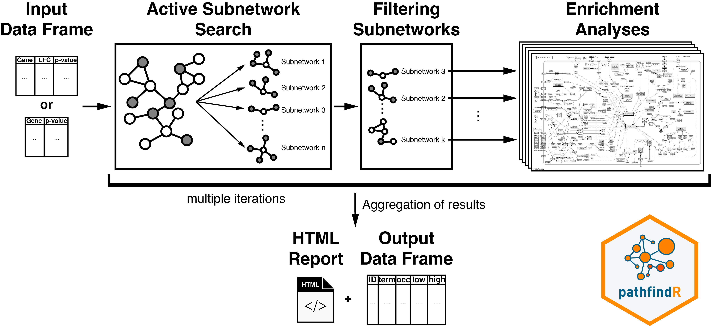
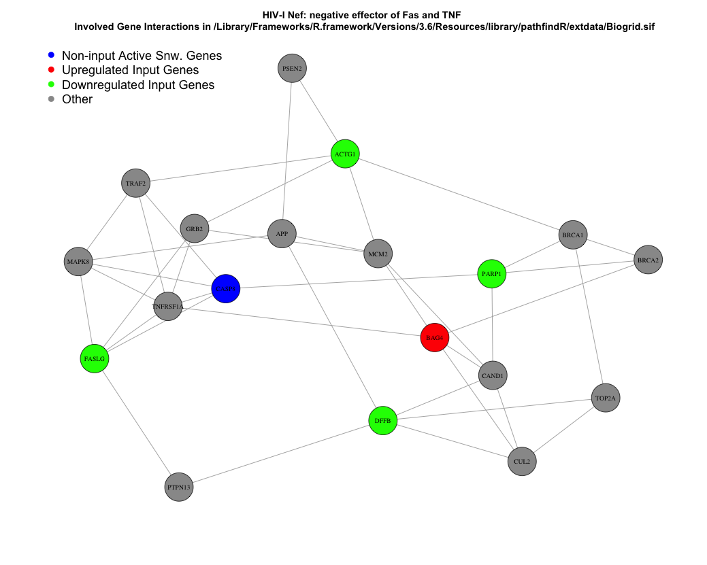
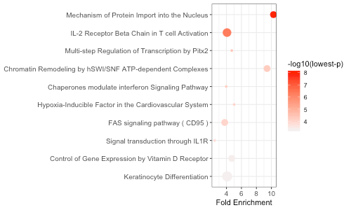

```{r setup, include = FALSE}
knitr::opts_chunk$set(collapse = TRUE,
                      comment = "#>")
```

This vignette walks through each step of the pathfindR active-subnetwork-oriented pathway enrichment analysis. For most purposes, the wrapper function `run_pathfindR()` can be used to perform this analysis from start to end. For users who wish to have further control over the enrichment workflow, this vignette will be more useful.




# Load the package and prepare the input data frame

We first need to load the package and the input data to be used for analysis. The input must be a data frame consisting of the following columns: `Gene Symbols`, `Change Values` (optional) and `p values`. The example data frame used in this vignette (`RA_input`) is the dataset containing the differentially-expressed genes for the GEO dataset GSE15573 comparing 18 rheumatoid arthritis (RA) patients versus 15 healthy subjects.

```{r init_steps}
suppressPackageStartupMessages(library(pathfindR))
data(RA_input)
head(RA_input, 3)
```

# The protein-protein interaction network (PIN)

For the active subnetwork search process, we will need a protein-protein interaction network (PIN). pathfindR will map the input genes onto this PIN and identify active subnetworks which will then be used for enrichment analyses.

> An active subnetwork can be defined as a group of interconnected genes in a protein-protein interaction network (PIN) that predominantly consists of significantly altered genes. In other words, active subnetworks define distinct disease-associated sets of interacting genes, whether discovered through the original analysis or discovered because of being in interaction with a significant gene.

The `pin_name_path` argument in all functions can be one of "Biogrid", "STRING", "GeneMania", "IntAct", "KEGG", "mmu_STRING" or it can be the path to a custom PIN file provided by the user.

# Process input data

We next need to process the input data for use in analysis via `input_processing()`:

```{r process}
RA_processed <- input_processing(input = RA_input, # the input: in this case, differential expression results
                                 p_val_threshold = 0.05, # p value threshold to filter significant genes
                                 pin_name_path  = "Biogrid", # the name of the PIN to use for active subnetwork search
                                 convert2alias = TRUE) # boolean indicating whether or not to convert missing symbols to alias symbols in the PIN
```

> After checking that the data frame complies with the requirements, `input_processing()` filters the input so that genes with p values larger than `p_val_threshold` are excluded. Next, gene symbols that are not in the PIN are identified and excluded. For human genes, if aliases of these missing gene symbols are found in the PIN, these symbols are converted to the corresponding aliases (controlled by the argument `convert2alias`). This step is performed to best map the input data onto the PIN.

# Obtain Gene Set Data

We obtain the necessary gene sets for enrichment analyses using `fetch_gene_set()`:

``` {r gene_set}
# using "BioCarta" as our gene sets for enrichment
biocarta_list <- fetch_gene_set(gene_sets = "BioCarta",
                                min_gset_size = 10,
                                max_gset_size = 300)
biocarta_gsets <- biocarta_list[[1]]
biocarta_descriptions <- biocarta_list[[2]]
```

> The available gene sets in pathfindR are "KEGG", "Reactome", "BioCarta", "GO-All", "GO-BP", "GO-CC" and "GO-MF". If the user prefers to use another gene set source, the `gene_sets` argument should be set to `"Custom"` and the custom gene sets (list) and the custom gene set desciptions (named vector) should be supplied via the arguments `custom_genes` and `custom_descriptions`, respectively. See `?fetch_gene_set` for more details.


# Active Subnetwork Search and Enrichment Analyses

As outlined in the vignette [Introduction to pathfindR](intro_vignette.html), `run_pathfindR()` initially identifies and filters active subnetworks, then performs enrichment analyses on these subnetworks and summarize the results.

To perform these steps manually, we utilize the function `active_snw_search()` for identifying and filtering active subnetworks and the function `enrichment_analyses()` for obtaining enriched terms using these subnetworks. Because the active subnetwork search algorithms are stochastic, we suggest iterating these subnetwork identification and enrichment steps multiple times [^1]:

[^1]: Here we are using a regular `for` loop. In the wrapper function `run_pathfindR()`, however, a parallel loop (via the package `foreach`) is used.

```{r snw_search, eval=FALSE}
n_iter <- 15 ## number of iterations
combined_res <- NULL ## to store the result of each iteration

for (i in 1:n_iter) {
  
  ###### Active Subnetwork Search
  snws_file <- paste0("active_snws_", i) # Name of output file
  active_snws <- active_snw_search(input_for_search = RA_processed, 
                                   pin_name_path = "Biogrid", 
                                   snws_file = snws_file,
                                   score_quan_thr = 0.8, # you may tweak these arguments for optimal filtering of subnetworks
                                   sig_gene_thr = 0.02, # you may tweak these arguments for optimal filtering of subnetworks
                                   search_method = "GR")
  
  ###### Enrichment Analyses
  current_res <- enrichment_analyses(snws = active_snws,
                                     input_genes = RA_processed$GENE,
                                     pin_name_path = "Biogrid", 
                                     genes_by_term = biocarta_gsets,
                                     term_descriptions = biocarta_descriptions,
                                     adj_method = "bonferroni",
                                     enrichment_threshold = 0.05,
                                     list_active_snw_genes = TRUE) # listing the non-input active snw genes in output
  
  ###### Combine results via `rbind`
  combined_res <- rbind(combined_res, current_res)
}
```

# Summary of Enrichment Results

We next summarize the enrichment results (in `combined_res`) using `summarize_enrichment_results()` and annotate the involved significant (input) genes in each term using `annotate_term_genes()`.

```{r post_proc, eval=FALSE}
###### Summarize Combined Enrichment Results
summarized_df <- summarize_enrichment_results(combined_res, 
                                              list_active_snw_genes = TRUE)

###### Annotate Affected Genes Involved in Each Enriched Term
final_res <- annotate_term_genes(result_df = summarized_df, 
                                 input_processed = RA_processed, 
                                 genes_by_term = biocarta_gsets)
```

# Visualizations

We can visualize each enriched term diagram using `visualize_terms()`. In this case, these will be graphs of interactions of pathway-involved genes for each pathway. See `?visualize_terms` for more details.

```{r vis_pws, eval=FALSE}
visualize_terms(result_df = final_res, 
                hsa_KEGG = FALSE, # boolean to indicate whether human KEGG gene sets were used for enrichment analysis or not
                pin_name_path = "Biogrid")
```



We can also create a graphical summary of the top 10 enrichment results using `enrichment_chart()`:

```{r enr_chart, eval=FALSE}
enrichment_chart(final_res[1:10, ])
```



The x-axis corresponds to fold enrichment values while the y-axis indicates the enriched terms. The size of each bubble indicates the number of significant genes in the given enriched term. Color indicates the -log10(lowest-p) value. The closer the color is to red, the more significant the enrichment is.
