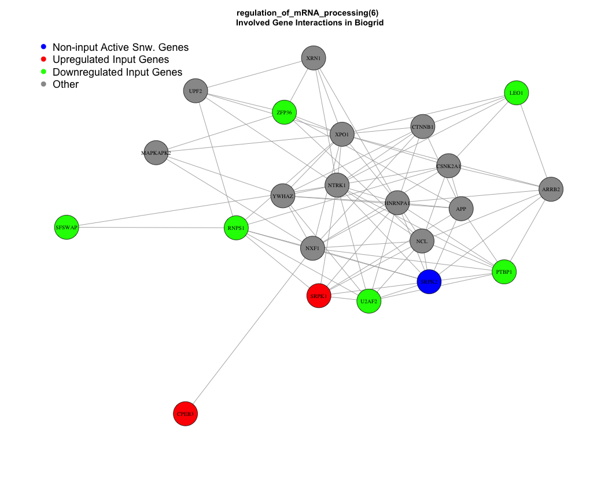

```{r setup, include = FALSE}
knitr::opts_chunk$set(
  collapse = TRUE,
  comment = "#>"
)
```

`pathfindR` is an R package for pathway enrichment analysis of gene-level differential expression/methylation data utilizing active subnetworks. The package also enables hierarchical clustering of the enriched pathways. The method is described in detail in Ulgen E, Ozisik O, Sezerman OU. 2018. pathfindR: An R Package for Pathway Enrichment Analysis Utilizing Active Subnetworks. bioRxiv. [https://doi.org/10.1101/272450](https://doi.org/10.1101/272450)

This vignette walks through each step of the pathfindR active-subnetwork-oriented pathway enrichment analysis. The wrapper function `run_pathfindR` can be used to perform this analysis from start to end but for users who need to have further control, the following script will be of much more use.

# Initial Steps

We first need to load the package and the data to be used. The input is a data frame consisting of `Gene Symbol`, `log-fold-change` (optional) and `adjusted-p values`.

```{r init_steps, eval=FALSE}
library(pathfindR)
data(RA_input)
```

Next, we get the full path to the PIN file to be used during analyses. The `pin_name_path` can be one of "Biogrid", "GeneMania", "IntAct" and "KEGG" or it can be the path to a custom PIN file supplied by the user.

```{r pin_path, eval=FALSE}
pin_path <- return_pin_path(pin_name_path = "Biogrid")
```

We process the input via:

```{r process, eval=FALSE}
RA_processed <- input_processing(input = RA_input, ## the input: in this case, differential expression results
                                 p_val_threshold = 0.05, ## p value threshold to filter DEGs
                                 pin_path = pin_path, ## path/to/Protein/Interaction/Network/File
                                 human_genes = TRUE) ## boolean indicating whether the input genes are human gene symbols
```

# Active Subnetwork Search and Enrichment Analyses

For active subnetwork search, we use the function `active_snw_search` and for enrichment analyses we use `enrichment_analyses`. Because the active subnetwork search algorithms are stochastic, we iterate the search and enrichment steps multiple times, and later summarize the results.

```{r snw_search, eval=FALSE}
n_iter <- 15 ## number of iterations
combined_res <- NULL ## to store each iteration's result
for (i in 1:n_iter) {
  ###### Active Subnetwork Search
  ## Name of output file
  snws_file <- paste0("active_snws_", i, ".txt")
  active_snws <- active_snw_search(RA_processed, pin_path, snws_file = snws_file, search_method = "GR")

  ###### Enrichment analyses
  enrichment_res <- enrichment_analyses(active_snws, gene_sets = "GO-All",
                                        pin_path = pin_path,
                                        input_genes = RA_processed$GENE,
                                        list_active_snw_genes = TRUE)
  ## combine all results via rbind
  combined_res <- rbind(combined_res, enrichment_res)
}
```

We next summarize the results and annotate the involved input genes in each pathway.

```{r post_proc, eval=FALSE}
##### Summarize Combined Enrichment Results
final_res <- summarize_enrichment_results(combined_res, list_active_snw_genes = TRUE)

##### Annotate DEGs Involved in Each Pathway
final_res <- annotate_pathway_DEGs(final_res, input_processed = RA_processed, gene_sets = "GO-All")
```

# Visualizations

Finally, we can visualize each pathway diagram (in this case graphs of interactions of pathway-involved genes for each pathway):

```{r vis_pws, eval=FALSE}
visualize_pws(final_res, RA_processed, gene_sets = "GO-All", pin_name_path = "Biogrid")
```



and also a graphical summary of enrichment results:

```{r enr_chart, eval=FALSE}
png("enrichment_chart.png", width = 650, height = 800)
enrichment_chart(final_res)
dev.off()
```
