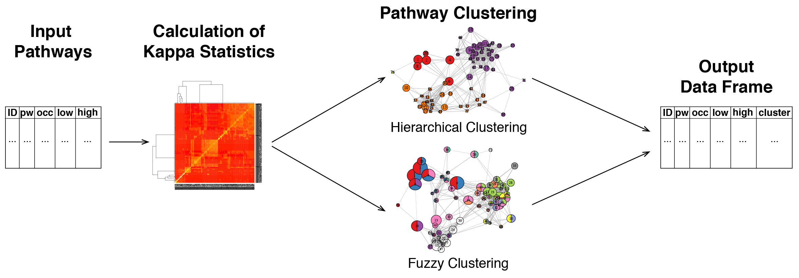

```{r setup, include = FALSE}
knitr::opts_chunk$set(
  collapse = TRUE,
  comment = "#>"
)
```

`pathfindR` is an R package for pathway enrichment analysis of gene-level differential expression/methylation data utilizing active subnetworks. The package also enables hierarchical clustering of the enriched pathways. The method is described in detail in Ulgen E, Ozisik O, Sezerman OU. 2018. pathfindR: An R Package for Pathway Enrichment Analysis Utilizing Active Subnetworks. bioRxiv. [https://doi.org/10.1101/272450](https://doi.org/10.1101/272450)

Our motivation to develop this package was that direct pathway enrichment analysis of differential RNA/protein expression or DNA methylation results may not provide the researcher with the full picture. That is to say; pathway enrichment of only the list of significant genes may not be informative enough to explain the underlying disease mechanisms. 

An active subnetwork is defined as a group of interconnected genes in a protein-protein interaction network (PIN) that contains most of the significant genes. Therefore, these active subnetworks define distinct disease-associated sets of genes, whether discovered through differential expression analysis or discovered because of being in interaction with a significant gene.

Therefore, we propose to leverage information from a PIN to identify distinct active subnetworks and then perform pathway enrichment analyses on these subnetworks. Briefly, this workflow first maps the significant genes onto a PIN and finds active subnetworks. Next, pathway enrichment analyses are performed using each gene set of the identified active subnetworks. Finally, these enrichment results are summarized and returned as a data frame. This workflow is implemented as the function `run_pathfindR()` and further described in the "Enrichment Workflow" section of this vignette.

This process usually yields a great number of enriched pathways with related biological functions. We therefore implemented a pairwise distance metric (as proposed by Chen et al. [1]) between pathways and based on this distance metric, also implemented hierarchical clustering of the pathways through a shiny app, allowing dynamic partitioning of the dendrogram into relevant clusters. Details of clustering and partitioning of pathways are presented in the "Pathway Clustering" section of this vignette.

# Enrichment Workflow

The overview of the enrichment workflow is presented in the figure below:


For this workflow, the wrapper function `run_pathfindR()` is used. This function takes in a data frame consisting of `Gene Symbol`, `log-fold-change` and `adjusted-p values`. The first 6 rows of an example input dataset (of rheumatoid arthritis differential-expression) can be found below:

```{r}
suppressPackageStartupMessages(library(pathfindR))
data("RA_input")
knitr::kable(head(RA_input))
```

Executing the workflow is straightforward (but takes several minutes):
```{r eval=FALSE}
RA_output <- run_pathfindR(RA_input)
```

The user may want to change certain arguments of the function:
```{r eval=FALSE}
# to change the output directory
RA_output <- run_pathfindR(RA_input, output = "new_directory")

# to change the PIN (default = Biogrid)
RA_output <- run_pathfindR(RA_input, pin_name = "IntAct")
# to use an external PIN of user's choice
RA_output <- run_pathfindR(RA_input, pin_name = "/path/to/myPIN.sif")

# available gene sets are KEGG, Reactome, BioCarta, GO-BP, GO-CC and GO-MF
# default is KEGG
# to change the gene sets used for enrichment analysis
RA_output <- run_pathfindR(RA_input, gene_sets = "BioCarta")

# to change the active subnetwork search algorithm (default = "GR", i.e. greedy algorithm)
# for simulated annealing:
RA_output <- run_pathfindR(RA_input, search_method = "SA")

# to change the number of iterations (default = 10)
RA_output <- run_pathfindR(RA_input, iterations = 5) 

# to manually specify the number processes used during parallel loop by foreach
# defaults to the number of detected cores 
RA_output <- run_pathfindR(RA_input, n_processes = 2)

# to report the non-DEG active subnetwork genes
RA_output <- run_pathfindR(RA_input, list_active_snw_genes = TRUE)
```
For a full list of arguments, see `?run_pathfindR`.

The workflow consists of the following steps :

After input testing, the program attempts to convert any gene symbol that is not in the PIN to an alias symbol that is in the PIN. Next, active subnetwork search is performed via the selected algorithm. The available algorithms for active subnetwork search are: 

- Greedy Algorithm (based on Ideker et al. [2]),
- Simulated Annealing Algorithm (based on Ideker et al. [2]) and 
- Genetic Algorithm (based on Ozisik et al. [3]).

Next, pathway enrichment analyses are performed using the genes in each of the active subnetworks. For this, up-to-date information on genes contained in each human KEGG pathway was retrieved with the help of the R package `KEGGREST` on Feb 26, 2018. These data are available in `genes_by_pathway` and `pathways_list`.

During enrichment analyses, pathways with adjusted-p values larger than the `enrichment_threshold` (an argument of `run_pathfindR()`, defaults to 0.05) are discarded. The results of enrichment analyses over all active subnetworks are combined by keeping only the lowest adjusted-p value for each pathway. 

This process of active subnetwork search and enrichment analyses is repeated for a selected number of iterations (indicated by the `iterations` argument of `run_pathfindR()`), which is performed in parallel via the R package `foreach`. 

The wrapper function returns a data frame that contains the lowest and the highest adjusted-p values for each enriched pathway, as well as the numbers of times each pathway is encountered over all iterations. The first two rows of the example output of the pathfindR-enrichment workflow (performed on the rheumatoid arthritis data `RA_output`) is shown below:

```{r}
data("RA_output")
knitr::kable(head(RA_output, 2))
```

The function also creates an HTML report `results.html` that is saved in a directory, by default named `pathfindr_Results` but can be changed by changing the argument `output_dir`, under the current working directory. This report contains links to two other HTML files:

## 1. all_pathways.html
This document contains a table of the active subnetwork-oriented pathway enrichment results. Each enriched pathway name is linked to the visualization of that pathway, with the gene nodes colored according to their log-fold-change values. This table contains the same information as the returned data frame. Columns are:

- ID: KEGG ID of enriched pathway
- Pathway: Description the pathway
- Fold_Enrichment: Fold enrichment value for the pathway.
- occurrence: The number of times the pathway was found to be enriched over all iterations
- lowest_p: the lowest adjusted-p value of the pathway over all iterations
- higher_p: the highest adjusted-p value of the pathway over all iterations
- Up_regulated: the up-regulated genes involved in the pathway
- Down_regulated: the down-regulated genes involved in the pathway

## 2. genes_table.html
This document contains a table of converted gene symbols. Columns are:

- Old Symbol: the original gene symbol
- Converted Symbol: the alias symbol that was found in the PIN
- Change: the provided change value
- p-value: the provided adjusted p value

The document contains a second table of genes for which no interactions were identified (after checking for alias symbols).

# Pathway Clustering



For this workflow, the wrapper function `choose_clusters()` is used. This function first calculates the pairwise distances between the pathways in the input data frame, automatically determining the gene sets used for analysis. This step uses the distance metric described by Chen et al. [1]. By default, the function clusters the pathways using this distance matrix, automatically determines the optimal number of clusters by maximizing the average silhouette width and returns a data frame with cluster assignments:

```{r, fig.height=4, fig.width=8}
data("RA_output")
RA_clustered <- choose_clusters(RA_output)
## First 2 rows of clustered pathways data frame
knitr::kable(head(RA_clustered, 2))
## The 16 representative pathways
knitr::kable(RA_clustered[RA_clustered$Status == "Representative", ])

# to display the heatmap of pathway clustering
RA_clustered <- choose_clusters(RA_output, plot_heatmap = TRUE)

# to display the dendrogram and clusters
RA_clustered <- choose_clusters(RA_output, plot_dend = TRUE)

# to change agglomeration method (default = "average")
RA_clustered <- choose_clusters(RA_output, agg_method = "centroid")
```

Alternatively, manual selection of the height at which to cut the dendrogram can be performed. For this, the user should set the `auto` parameter to `FALSE`. Via a shiny app, presented as an HTML document, the hierarchical clustering dendrogram is visualized. In this HTML document, the user can select the agglomeration method and the distance value at which to cut the tree. The dendrogram with the cut-off value marked with a red line is dynamically visualized and the resulting cluster assignments of the pathways along with annotation of representative pathways (chosen by smallest lowest p value) are presented as a table. This table can be saved as a csv file by pressing the button `Get Pathways w\ Cluster Info`. Example usage:

```{r eval=FALSE}
choose_clusters(RA_output, auto = FALSE)
```

# Pathway Scores per Sample

The function `calculate_pw_scores` can be used to calculate the pathway scores per sample. This allows the user to individually examine the scores and infer whether a pathway is activated or repressed in a given sample.

For a set of pathways $P = \{P_1, P_2, ... , P_k\}$, where each $P_i$ contains a set of genes, i.e. $P_i = \{g_1, g_2, ...\}$, the pathway score matrix $PS$ is defined as:

$PS_{p,s} = \frac{1}{k} \sum_{g \in P_p} GS_{g,s}$ for each pathway $p$ and for each sample $s$.

$GS$ is the gene score per sample matrix and is defined as:
$GS_{g,s} = (EM_{g,s} - \bar{x}_g) / sd_g$ where $EM$ is the expression matrix (columns are samples, rows are genes), $\bar{x}_g$ is the mean expression value of the gene and $sd_g$ is the standard deviaton of the expression values for the gene.

An example application is provided below:

```{r, fig.height=4, fig.width=8}
## Pathway data frame
pws_table <- pathfindR::RA_clustered
# selecting "Representative" pathways for clear visualization
pws_table <- pws_table[pws_table$Status == "Representative", ]

## Expression matrix
exp_mat <- pathfindR::RA_exp_mat

## Vector of "Case" IDs
cases <- c("GSM389703", "GSM389704", "GSM389706", "GSM389708", 
           "GSM389711", "GSM389714", "GSM389716", "GSM389717", 
           "GSM389719", "GSM389721", "GSM389722", "GSM389724", 
           "GSM389726", "GSM389727", "GSM389730", "GSM389731", 
           "GSM389733", "GSM389735")

## Calculate pathway scores and plot heatmap
score_matrix <- calculate_pw_scores(pws_table, exp_mat, cases)
```


[1] *Chen YA, Tripathi LP, Dessailly BH, Nyström-persson J, Ahmad S, Mizuguchi K. Integrated pathway clusters with coherent biological themes for target prioritisation. PLoS ONE. 2014;9(6):e99030. \doi 10.1371/journal.pone.0099030 *

[2] *Ideker T, Ozier O, Schwikowski B, Siegel AF. Discovering regulatory and signalling circuits in molecular interaction networks. Bioinformatics. 2002;18 Suppl 1:S233-40.*

[3] *Ozisik O, Bakir-Gungor B, Diri B, Sezerman OU. Active Subnetwork GA: A Two Stage Genetic Algorithm Approach to Active Subnetwork Search. Current Bioinformatics. 2017; 12(4):320-8. \doi 10.2174/1574893611666160527100444 *
