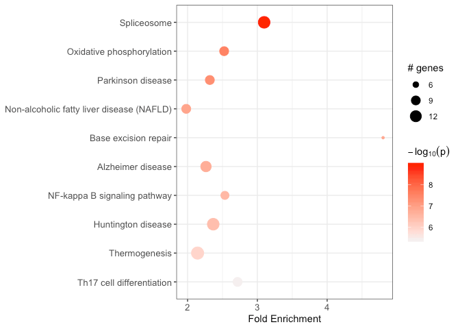
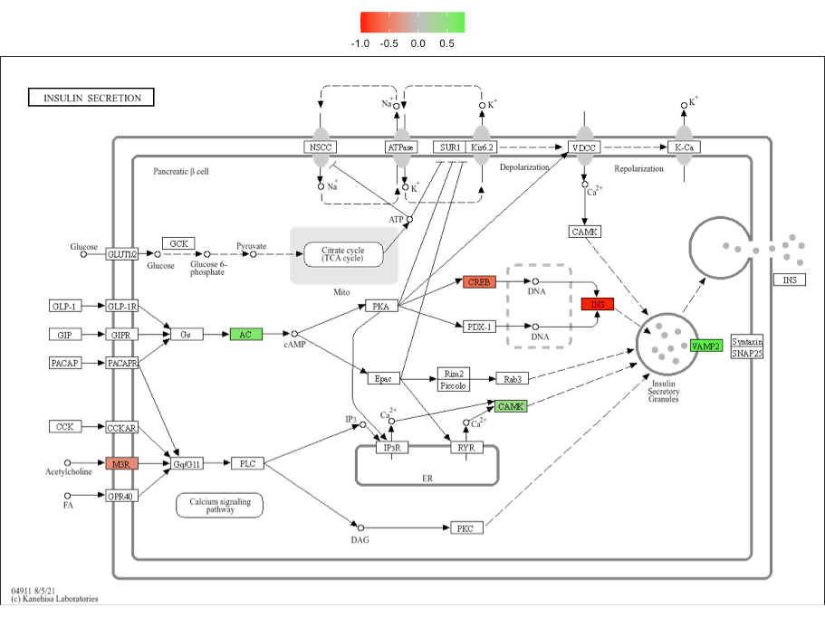
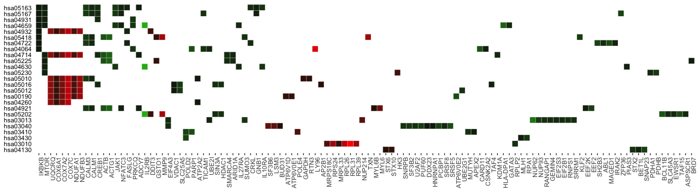
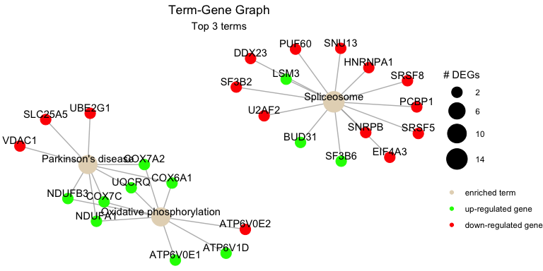
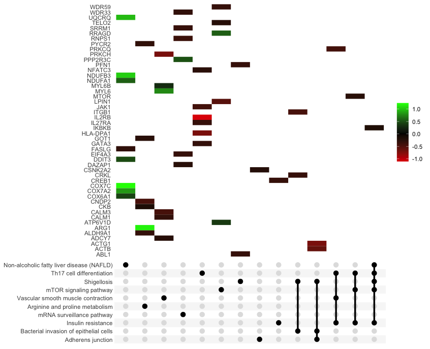

```{r, include = FALSE}
knitr::opts_chunk$set(
  collapse = TRUE,
  comment = "#>",
  fig.width = 8, fig.height = 4, fig.align = "center"
)
```
```{r setup}
suppressPackageStartupMessages(library(pathfindR))
```

`pathfindR` offers various functionality to visualize the enrichment results. In this vignette, I try to demonstrate these functionalities.

## `enrichment_chart()`: Bubble Chart of Enrichment Results

`enrichment_chart` generates a bubble chart. The x-axis corresponds to fold enrichment values while the y-axis indicates the enriched terms. Size of the bubble indicates the number of significant genes in the given enriched term. Color indicates the -log10(lowest-p) value. The closer the color is to red, the more significant the enrichment is.

```{r enr_chart, eval=FALSE}
enrichment_chart(example_pathfindR_output)
```



By default, the bubble chart is generated for the top 10 terms. This can be controlled by the `top_terms` argument:

```{r enr_chart2, eval=FALSE}
## change top_terms
enrichment_chart(example_pathfindR_output, top_terms = 3)

## set null for displaying all terms
enrichment_chart(example_pathfindR_output, top_terms = NULL)
```

If the enrichment results were clustered, setting `plot_by_cluster == TRUE` will result in the enriched terms to be grouped by clusters:

```{r enr_chart3, fig.height=8, fig.width=8}
enrichment_chart(example_pathfindR_output_clustered, plot_by_cluster = TRUE)
```

See `?enrichment_chart` for more details.

## `visualize_terms()`: Enriched Term Diagrams

For KEGG enrichment analyses, `visualize_terms()` can be used to generate KEGG pathway diagrams that are returned as a list of `ggraph` objects (using [`ggkegg`](https://github.com/noriakis/ggkegg))::

```{r KEGG_vis, eval=FALSE}
input_processed <- input_processing(example_pathfindR_input)
gg_list <- visualize_terms(
  result_df = example_pathfindR_output,
  input_processed = input_processed,
  is_KEGG_result = TRUE
)  # this function returns a list of ggraph objects (named by Term ID)

# save one of the plots as PDF image
ggplot2::ggsave(
  "hsa04911_diagram.pdf",   # path to output, format is determined by extension
  gg_list$hsa04911,         # what to plot
  width = 5                 # adjust width
  height = 5                # adjust height
) 
```



Alternatively (i.e., for other types of non-KEGG enrichment analyses), an interaction diagram per enriched term can be generated again via `visualize_terms()`. These diagrams are also returned as a list of `ggraph` objects:

```{r nonKEGG_viss, eval=FALSE}
input_processed <- input_processing(example_pathfindR_input)
gg_list <- visualize_terms(
  result_df = example_pathfindR_output,
  input_processed = input_processed,
  is_KEGG_result = FALSE,
  pin_name_path = "Biogrid"
)  # this function returns a list of ggraph objects (named by Term ID)

# save one of the plots as PDF image
ggplot2::ggsave(
  "diabetic_cardiomyopathy_interactions.pdf",   # path to output, format is determined by extension
  gg_list$hsa04911,                             # what to plot
  width = 10                                    # adjust width
  height = 6                                    # adjust height
) 
```


See `?visualize_terms` for more details.

## `term_gene_heatmap()`: Terms by Genes Heatmap

`term_gene_heatmap()` is used to create a heatmap where rows are enriched terms and columns are involved input genes. This heatmap allows visual identification of the input genes involved in the enriched terms, as well as the common or distinct genes between different terms. 

```{r hmap}
term_gene_heatmap(example_pathfindR_output)
```

By default, the heatmap is generated for the top 10 terms. This can be controlled by the `num_terms` argument:

```{r hmap2, eval=FALSE}
term_gene_heatmap(example_pathfindR_output, num_terms = 3)

## set null for displaying all terms
term_gene_heatmap(example_pathfindR_output, num_terms = NULL)
```

By default, the term ids are used. For using full descriptions, set `use_description = TRUE`

```{r hmap3, eval=FALSE}
term_gene_heatmap(example_pathfindR_output, use_description = TRUE)
```

If the input data frame (same as in `run_pathfindR()`) is supplied, the tile colors indicate the change values:

```{r hmap4, eval=FALSE}
term_gene_heatmap(result_df = example_pathfindR_output, genes_df = example_pathfindR_input)
```



See `?term_gene_heatmap` for more details.

## `term_gene_graph()`: Term-Gene Graph

The function `term_gene_graph()` (adapted from the Gene-Concept network visualization by the R package `enrichplot`) can be utilized to visualize which significant genes are involved in the enriched terms. The function creates the term-gene graph, displaying the connections between genes and biological terms (enriched pathways or gene sets). This allows for the investigation of multiple terms to which significant genes are related. The graph also enables determination of the degree of overlap between the enriched terms by identifying shared and/or distinct significant genes.
By default, the function visualizes the term-gene graph for the top 10 enriched terms:

```{r term_gene1}
term_gene_graph(example_pathfindR_output)
```

To plot all of the enriched terms in the enrichment results, set `num_terms = NULL` (not advised due to cluttered visualization):

```{r term_gene2, eval=FALSE}
term_gene_graph(example_pathfindR_output, num_terms = NULL)
```

To plot using full term names (instead of IDs which is the default), set `use_description = TRUE`:

```{r term_gene3, eval=FALSE}
term_gene_graph(example_pathfindR_output, num_terms = 3, use_description = TRUE)
```



By default the node sizes are plotted proportional to the number of genes a term contains (`num_genes`). To adjust node sizes using the $-log_{10}$(lowest p values), set `node_size = "p_val"`:

```{r term_gene4, eval=FALSE}
term_gene_graph(example_pathfindR_output, num_terms = 3, node_size = "p_val")
```

See `?term_gene_graph` for more details.

## `UpSet_plot()`: UpSet Plots of Enriched Terms

UpSet plots are plots of the intersections of sets as a matrix. `UpSet_plot()` creates a ggplot object of an UpSet plot where the x-axis is the UpSet plot of intersections of enriched terms. By default (`method = "heatmap"`), the main plot is a heatmap of genes at the corresponding intersections, colored by up/down regulation:

```{r upset1}
UpSet_plot(example_pathfindR_output)
```

If genes_df is provided, the heatmap tiles are colored by change values:

```{r upset2, eval=FALSE}
UpSet_plot(example_pathfindR_output, genes_df = example_pathfindR_input)
```



Again, you may change the number of top terms plotted via `num_terms` (default = 10):

```{r upset3, eval=FALSE}
UpSet_plot(example_pathfindR_output, num_terms = 5)
```

Again, to plot using full term names (instead of IDs which is the default), set `use_description = TRUE`:

```{r upset4, eval=FALSE}
UpSet_plot(example_pathfindR_output, use_description = TRUE)
```

If `method = "barplot"`, the main plot is a bar plots of the number of genes in the corresponding intersections:

```{r upset5, eval=FALSE}
UpSet_plot(example_pathfindR_output, method = "barplot")
```

If `method = "boxplot"` and if `genes_df` is provided, then the main plot displays the boxplots of change values of the genes within the corresponding intersections:

```{r upset6, eval=FALSE}
UpSet_plot(example_pathfindR_output, example_pathfindR_input, method = "boxplot")
```

See `?UpSet_plot` for more details.

